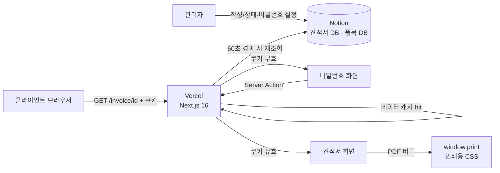

# Invoice Web MVP PRD

> 작성일: 2026-10-01 · 수정일: 2026-10-02 · 대상 기간: 2주(작업일 10일) · 개발 인원: 1인

## 1. 개요

### 한 줄 요약
프리랜서가 노션에 작성한 견적서를 링크와 열람 비밀번호로 클라이언트에게 보여주고, 클라이언트가 PDF로 저장할 수 있게 하는 웹 앱.

### 배경 및 문제 정의
현재 견적서 전달 방식(엑셀/한글 작성 → PDF 변환 → 이메일 첨부)의 불편함:
- 수정할 때마다 파일 변환과 재첨부가 반복되어 1건당 10~15분이 걸린다.
- `견적서_최종_v3.pdf`처럼 버전이 여러 개 생겨, 클라이언트가 어느 것이 최신인지 헷갈린다.
- 모바일에서 첨부 PDF를 열면 확대와 스크롤이 필요해 읽기 어렵다.
- 견적 데이터가 노션(프로젝트 관리)과 문서 파일에 나뉘어 있어 중복 입력이 생긴다.

### 목표
- 관리자는 노션 외에 다른 도구를 쓰지 않고 견적서를 발행한다.
- 클라이언트는 링크와 비밀번호로 최신 견적서를 확인하고 PDF로 저장한다.
- 금액 계산(공급가액, 부가세, 합계)을 앱이 자동으로 정확하게 처리한다.

### 비목표 (Non-goals)
- 웹 기반 관리자 페이지(작성/수정 UI)
- 로그인, 회원가입 (견적서별 열람 비밀번호만 지원)
- 견적 승인, 전자서명, 결제
- 이메일/메신저 자동 발송
- 다국어, 다중 통화(원화만 지원)
- 서버 측 PDF 파일 생성
- 성능 목표 수치화와 고급 최적화(LCP/번들 크기 목표, 온디맨드 재검증 등) → 11장 「성능 최적화」. 단, 429 방지를 위한 60초 데이터 캐시(F-013)는 MVP에 포함

### 성공 지표
| 지표 | 목표치 | 측정 방법 |
|------|--------|-----------|
| 노션 작성 완료부터 링크·비밀번호 전송까지 걸리는 시간 | 2분 이내 | 관리자 직접 측정(5건 평균) |
| 링크 접속부터 PDF 저장 완료까지 클릭 수 | 비밀번호 입력 제외 3회 이하(데스크톱 Chrome) | 시나리오 수동 테스트 |
| 금액 계산 오류 | 0건 | 계산 함수 단위 테스트 + 실제 견적 10건 대조 |
| 비밀번호 없이 견적서 내용이 노출되는 경우 | 0건 | 9장 접근 관련 케이스 수동 테스트 |
| 견적서 페이지 5xx 비율 | 1% 미만 | Vercel 로그(배포 후 2주) |

## 2. 사용자 정의

### 관리자 — 프리랜서 개발자 1인
- **목표**: 외주 견적을 빠르게 보내고, 수정 사항을 즉시 반영한다.
- **페인 포인트**: 문서 서식 맞추기와 PDF 변환이 반복되고, 부가세를 손으로 계산하다 실수한다. 노션에 프로젝트 정보가 이미 있는데 또 입력해야 한다.
- **기술 수준**: 노션 DB, 속성 사용에 익숙하다.

### 클라이언트 — 외주 의뢰 기업 담당자
- **목표**: 견적 금액과 범위를 확인하고, 사내 결재용 PDF를 받는다.
- **페인 포인트**: 최신 견적서를 찾기 어렵고, 이동 중 모바일로 첨부 파일을 보기 불편하다. 회원가입이나 앱 설치는 원하지 않는다.
- **환경**: 데스크톱 Chrome/Edge(결재 상신), 모바일 Safari/Chrome(1차 확인).

## 3. 사용자 시나리오

### 관리자: 노션 작성 → 링크 공유
1. 노션 「견적서」 DB에 새 페이지를 만들고 제목, 클라이언트명, 발행일, 유효기한을 입력한다.
2. 페이지 안의 「품목」 연결 DB 뷰에 품목명, 수량, 단가를 입력한다.
3. `열람 비밀번호`에 8자 이상 비밀번호를 입력한다.
4. `상태`를 `작성중` → `발행`으로 바꾼다.
5. `공유 링크` 수식 속성에 만들어진 URL(`https://{도메인}/invoice/{ID}`)을 복사한다.
6. 링크를 열어 비밀번호를 입력하고 내용을 확인한다.
7. 링크와 비밀번호를 **서로 다른 채널**로 보낸다. (예: 링크는 이메일, 비밀번호는 문자)
8. 수정이 필요하면 노션에서 고친다. 최대 60초 안에 웹에 반영된다.

### 클라이언트: 링크 접속 → 확인 → PDF 다운로드
1. 받은 링크를 클릭한다.
2. 비밀번호 입력 화면에서 전달받은 비밀번호를 입력한다. (7일 동안 같은 브라우저에서는 다시 묻지 않음)
3. 견적서(발행자, 수신자, 품목, 합계, 유효기한, 비고)를 확인한다.
4. 「PDF 다운로드」 버튼을 누른다.
5. 브라우저 인쇄 대화상자에서 대상을 「PDF로 저장」으로 고른다. (버튼 옆 안내 문구로 안내)
6. `견적서_Q-12_{클라이언트명}.pdf` 같은 이름으로 저장된다. (`document.title` 기반, 브라우저에 따라 다를 수 있음)

## 4. 기능 요구사항

### MVP 범위 (P0)
| ID | 기능명 | 설명 | 우선순위 | 수용 기준 |
|----|--------|------|----------|-----------|
| F-001 | 견적서 조회 | `/invoice/[id]`에서 Notion 페이지 ID로 견적서와 품목을 조회해 렌더링 | P0 | 인증된 상태로 유효한 발행 견적서에 접속하면 모든 필수 속성이 표시된다 |
| F-002 | ID 형식 검증 | 32자리 hex(하이픈 포함/미포함)만 허용 | P0 | 형식이 틀린 ID는 Notion API를 호출하지 않고 404를 반환한다 |
| F-003 | 소속 DB 검증 | 조회한 페이지의 부모가 `NOTION_DATABASE_ID`인지 확인 | P0 | 통합(integration)에 공유된 다른 페이지 ID로 접속하면 404를 반환한다 |
| F-004 | 공개 상태 제어 | `상태`가 `발행`, `승인`이고 `열람 비밀번호`가 있을 때만 공개 | P0 | `작성중`, `취소`, 비밀번호가 빈 견적서는 404를 반환하고, 상태를 바꾸면 60초 안에 반영된다 |
| F-005 | 금액 자동 계산 | 품목 금액, 공급가액, 부가세, 합계를 앱에서 계산 | P0 | 4.1의 계산 규칙과 테스트 케이스 10개가 모두 일치한다 |
| F-006 | 반응형 레이아웃 | 데스크톱은 표, 모바일은 카드 목록 | P0 | 375px 폭에서 가로 스크롤 없이 모든 정보가 보이고, 1280px에서 본문 최대 폭은 800px이다 |
| F-007 | PDF 다운로드 | 버튼 클릭 시 `window.print()` 실행, 인쇄용 CSS 적용 | P0 | Chrome, Edge, Safari 최신 버전에서 A4 세로로 저장되고, 버튼은 출력되지 않으며, 한글이 깨지지 않고 텍스트를 선택할 수 있다 |
| F-008 | 에러/404 화면 | 존재하지 않음/비공개는 404, API 장애는 에러 화면 | P0 | 각 상황에서 안내 문구가 표시되고, 오류 원인(Notion 메시지 등)은 노출하지 않는다 |
| F-009 | 공유 링크 수식 | 노션 수식 속성으로 공유 URL 자동 생성 | P0 | 새 견적서 페이지를 만들면 `공유 링크` 속성에 접속 가능한 URL이 표시된다 |
| F-010 | 검색 노출 차단 | `noindex, nofollow` 메타 태그와 `Referrer-Policy: no-referrer` | P0 | 응답 HTML에 robots 메타가 있고, 응답 헤더에 Referrer-Policy가 있다 |
| F-011 | 열람 비밀번호 확인 | 인증 쿠키가 없으면 비밀번호 입력 화면 표시, 서버에서 노션 값과 비교 | P0 | 비밀번호 화면의 HTML에 견적서 내용(금액, 품목, 클라이언트명)이 포함되지 않는다. 틀리면 「비밀번호가 일치하지 않습니다」를 표시한다 |
| F-012 | 열람 세션 쿠키 | 통과 시 견적서별 서명 쿠키 발급(7일) | P0 | 7일 안에 재접속하면 비밀번호를 묻지 않는다. 노션에서 비밀번호를 바꾸면 60초 안에 기존 쿠키로는 열리지 않는다 |
| F-013 | Notion 데이터 캐시 | 견적서·품목 조회 결과를 견적서 ID별로 60초 캐시(시간 기반 재검증) | P0 | 같은 견적서를 60초 안에 여러 번 새로고침해도 Notion API 호출은 최대 1세트(2~3회)만 발생한다(서버 로그로 확인) |

### 4.1 금액 계산 규칙
| 항목 | 규칙 |
|------|------|
| 단가 | 0 이상의 정수(원) |
| 수량 | 0보다 큰 수, 소수점 둘째 자리까지 허용(예: 0.5 M/M) |
| 품목 금액 | `수량 × 단가`, 원 미만 **절사**. 부동소수 오차를 막기 위해 수량을 100배한 정수로 계산 |
| 공급가액 | 품목 금액의 합 |
| 부가세 | `부가세 적용`이 체크되어 있으면 `공급가액 × 10%`, 원 미만 **절사**. 체크 해제 시 0 |
| 합계 | `공급가액 + 부가세` |
| 표기 | `Intl.NumberFormat("ko-KR")` + `원` (예: `1,234,000원`). 음수는 허용하지 않음(할인은 P1) |

### 향후 고려 (P1/P2)
| ID | 기능명 | 우선순위 |
|----|--------|----------|
| F-101 | 유효기한 경과 시 「만료됨」 배너 | P1 |
| F-102 | 할인 품목(음수 금액) 지원 | P1 |
| F-103 | 합계 한글 금액 표기(일금 일백만원정) | P1 |
| F-104 | 비밀번호 시도 횟수 제한(외부 저장소 필요) | P1 |
| F-105 | 공유 토큰 속성으로 URL 재발급 | P1 |
| F-201 | 서버 생성 PDF 파일 직접 다운로드 | P2 |
| F-202 | 열람 기록(최초 열람 시각) 노션에 기록 | P2 |
| F-203 | 이메일 인증 링크(매직 링크) 방식 접근 | P2 |

## 5. 노션 데이터 모델

### 견적서 DB (`NOTION_DATABASE_ID`)
| 속성명 | Notion 타입 | 필수 | 설명 |
|--------|-------------|------|------|
| 제목 | title | 필수 | 견적서 제목(예: 쇼핑몰 리뉴얼 개발) |
| 견적번호 | unique_id (접두사 `Q`) | 필수 | 자동 증가 번호(예: `Q-12`) |
| 상태 | status | 필수 | `작성중` / `발행` / `승인` / `취소` |
| 열람 비밀번호 | rich_text | 필수 | 8자 이상. 비어 있으면 비공개로 처리 |
| 클라이언트명 | rich_text | 필수 | 수신 회사명 |
| 담당자명 | rich_text | 선택 | 수신 담당자 |
| 담당자 이메일 | email | 선택 | 표시용 |
| 발행일 | date | 필수 | 날짜만 사용(시간 무시) |
| 유효기한 | date | 필수 | 견적 유효 마지막 날 |
| 부가세 적용 | checkbox | 필수 | 기본값 체크 |
| 품목 | relation → 품목 DB | 필수 | 0개 이상 |
| 비고 | rich_text | 선택 | 결제 조건, 작업 범위 등. 일반 텍스트와 줄바꿈만 렌더링 |
| 공유 링크 | formula | 선택 | `"https://{도메인}/invoice/" + replaceAll(id(), "-", "")` |

### 품목 DB (`NOTION_ITEMS_DATABASE_ID`)
| 속성명 | Notion 타입 | 필수 | 설명 |
|--------|-------------|------|------|
| 품목명 | title | 필수 | 예: 메인 페이지 퍼블리싱 |
| 견적서 | relation → 견적서 DB | 필수 | 소속 견적서 |
| 설명 | rich_text | 선택 | 세부 내용 |
| 수량 | number | 필수 | 0 초과, 소수 둘째 자리까지 |
| 단위 | select | 선택 | `식` / `개` / `시간` / `M/M` |
| 단가 | number (원) | 필수 | 0 이상 정수 |
| 순서 | number | 선택 | 오름차순 정렬, 없으면 생성 시각 순 |
| 금액 | formula | 선택 | `수량 × 단가`. 관리자 확인용이며 앱은 이 값을 쓰지 않고 다시 계산 |

### 품목 표현 방식 비교
| 기준 | A. relation DB (권장) | B. 페이지 내 table 블록 |
|------|----------------------|------------------------|
| 데이터 타입 | number 타입이라 수량/단가가 숫자로 보장됨 | 모든 셀이 rich_text라 문자열 파싱 필요(`1,000`, `1천` 등 오류 위험) |
| API 호출 수 | 페이지 조회 1 + 품목 DB 필터 쿼리 1 = **2회** | 페이지 조회 1 + 블록 목록 1 + 테이블 행 1 = 3회 이상 |
| 작성 편의성 | 견적서 페이지 안에 연결 DB 뷰를 두면 표처럼 입력 가능. 처음 설정이 필요함 | 페이지 안에서 바로 표 입력, 가장 직관적 |
| 확장성 | 품목 통계, 재사용, 노션 수식 가능 | 낮음 |
| 트레이드오프 | DB 2개 관리, 초기 템플릿 설정에 30분 정도 | 열 순서/헤더 규칙을 관리자가 지켜야 함 |

**권장안: A. relation DB.** 금액 데이터의 타입 안정성이 견적서의 핵심이고, API 호출도 더 적다. 노션 「템플릿」 기능으로 견적서 페이지 안에 품목 연결 뷰를 미리 넣어 작성 불편을 줄인다.

### TypeScript 타입 초안 (`src/types/invoice.ts`)
```typescript
export type InvoiceStatus = "draft" | "issued" | "approved" | "canceled"

export interface InvoiceItem {
  id: string
  name: string
  description: string | null
  quantity: number
  unit: string | null
  unitPrice: number
  order: number | null
}

export interface InvoiceTotals {
  subtotal: number
  vat: number
  total: number
}

export interface Invoice {
  id: string
  number: string
  title: string
  status: InvoiceStatus
  clientName: string
  contactName: string | null
  contactEmail: string | null
  issuedAt: string // YYYY-MM-DD
  validUntil: string // YYYY-MM-DD
  vatApplied: boolean
  notes: string | null
  items: InvoiceItem[]
}

// 비밀번호는 서버에서만 다루고 컴포넌트에는 Invoice만 전달
export interface InvoiceAccess {
  id: string
  status: InvoiceStatus
  password: string
}

export type VerifyPasswordState = { error: string | null }
```

### 핵심 함수 시그니처
```typescript
// src/lib/notion/invoice-repository.ts (server-only)
export function getInvoiceAccess(id: string): Promise<InvoiceAccess | null> // 미존재·비공개·타 DB면 null
export function getInvoice(id: string): Promise<Invoice | null>

// src/lib/notion/invoice-mapper.ts
export function toInvoice(page: PageObjectResponse, items: InvoiceItem[]): Invoice
export function toInvoiceItem(page: PageObjectResponse): InvoiceItem

// src/lib/invoice/access-token.ts (server-only)
export function createAccessToken(access: InvoiceAccess, issuedAt: number): string
export function verifyAccessToken(token: string, access: InvoiceAccess, now: number): boolean
export function isPasswordMatch(input: string, expected: string): boolean // 상수 시간 비교

// src/app/invoice/[id]/actions.ts ('use server')
export function verifyPassword(id: string, prev: VerifyPasswordState, formData: FormData): Promise<VerifyPasswordState>

// src/lib/invoice/calculate.ts
export function calculateItemAmount(item: InvoiceItem): number
export function calculateTotals(items: InvoiceItem[], vatApplied: boolean): InvoiceTotals

// src/lib/invoice/format.ts
export function formatKRW(amount: number): string
export function formatDate(isoDate: string): string // 2026. 10. 01.

// src/lib/invoice/page-id.ts
export function normalizePageId(raw: string): string | null
export function isPublicStatus(status: InvoiceStatus): boolean
```
노션 응답은 `src/lib/validations/invoice.ts`의 Zod 스키마로 매핑 후 검증한다. 필수 속성이 빠지면 에러 화면(F-008)을 보여주고 서버 로그에 속성명을 남긴다.

## 6. 화면 설계

### 페이지 목록 및 라우트
| 라우트 / 상태 | 화면 | 렌더링 |
|---------------|------|--------|
| `/invoice/[id]` 인증 쿠키 없음/무효 | 비밀번호 입력 | 서버 컴포넌트 + 폼만 클라이언트 |
| `/invoice/[id]` 인증 쿠키 유효 | 견적서 상세 | 서버 컴포넌트(동적 렌더링) + 데이터 캐시 60초 |
| 미존재 / 비공개 / 형식 오류 / 타 DB | 404 | `app/invoice/[id]/not-found.tsx` |
| Notion API 장애, 데이터 검증 실패 | 에러 | `app/invoice/[id]/error.tsx` (클라이언트) |
| `/` | 기존 스타터 홈. MVP에서는 서비스 소개 한 줄로 교체 | 정적 |

견적서 화면에는 스타터킷의 사이트 Header/Footer를 넣지 않는다. 기존 `layout.tsx`의 Header/Footer를 `app/(site)/layout.tsx`로 옮기고, `app/invoice/`는 route group 밖에 둔다.

### 비밀번호 입력 (모든 화면 폭 공통, 카드 최대 400px)
```
┌─────────────────────────────┐
│          🔒                 │
│   견적서 열람 비밀번호       │
│   전달받은 비밀번호를        │
│   입력해 주세요.             │
│  ┌───────────────────────┐  │
│  │ ••••••••          👁  │  │
│  └───────────────────────┘  │
│  비밀번호가 일치하지 않습니다│ ← 오류 시
│  [        확인         ]    │
└─────────────────────────────┘
```

### 데스크톱 (≥ 768px, 본문 최대 800px 중앙 정렬)
```
┌──────────────────────────────────────────────────────────┐
│                                      [⬇ PDF 다운로드]     │
│                            인쇄 대화상자에서 'PDF로 저장' │
├──────────────────────────────────────────────────────────┤
│  견 적 서                                  견적번호 Q-12  │
│  쇼핑몰 리뉴얼 개발                    발행일 2026.10.01  │
│                                      유효기한 2026.10.31  │
├────────────────────────────┬─────────────────────────────┤
│ 수신                       │ 발신                        │
│ (주)에이비씨 귀중          │ 홍길동 (프리랜서)           │
│ 담당 김담당 / a@abc.com    │ 사업자 000-00-00000         │
├────┬──────────────────┬──────┬────┬──────────┬───────────┤
│ No │ 품목 / 설명      │ 수량 │단위│     단가 │      금액 │
├────┼──────────────────┼──────┼────┼──────────┼───────────┤
│ 1  │ 메인 페이지 개발 │    1 │ 식 │1,500,000 │ 1,500,000 │
│ 2  │ 유지보수         │  0.5 │M/M │4,000,000 │ 2,000,000 │
├────┴──────────────────┴──────┴────┴──────────┴───────────┤
│                                  공급가액     3,500,000원 │
│                                  부가세(10%)    350,000원 │
│                                  합계         3,850,000원 │
├──────────────────────────────────────────────────────────┤
│ 비고: 계약금 50% 선금, 잔금 납품 후 7일 이내              │
└──────────────────────────────────────────────────────────┘
```

### 모바일 (< 768px, 좌우 여백 16px)
```
┌─────────────────────────┐
│ 견적서         Q-12     │
│ 쇼핑몰 리뉴얼 개발      │
│ 발행 2026.10.01         │
│ 유효 2026.10.31         │
├─────────────────────────┤
│ 수신 (주)에이비씨 귀중  │
│ 발신 홍길동             │
├─────────────────────────┤
│ ┌─────────────────────┐ │
│ │1. 메인 페이지 개발  │ │
│ │1식 × 1,500,000      │ │
│ │          1,500,000원│ │
│ └─────────────────────┘ │
├─────────────────────────┤
│ 공급가액   3,500,000원  │
│ 부가세       350,000원  │
│ 합계       3,850,000원  │
├─────────────────────────┤
│ [   ⬇ PDF 다운로드   ]  │ ← 하단 고정(sticky)
└─────────────────────────┘
```

### 레이아웃 차이
| 항목 | 데스크톱 | 모바일 | 인쇄(PDF) |
|------|----------|--------|-----------|
| 품목 | `<table>` | 카드 목록(`md:hidden` / `hidden md:table` 전환) | 항상 `<table>` |
| PDF 버튼 | 우측 상단 | 하단 sticky, 높이 48px 이상 | 숨김(`print:hidden`) |
| 수신/발신 | 2열 | 1열 | 2열 |
| 용지 | — | — | `@page { size: A4; margin: 15mm }` |
| 배경/색상 | 흰 배경 고정 | 흰 배경 고정 | 흰 배경, 배경색 출력 없이도 구분되도록 테두리 사용 |
| 페이지 나눔 | — | — | 행 단위 `break-inside: avoid`, 표 헤더 반복(`thead { display: table-header-group }`) |

견적서 본문은 다크 모드와 상관없이 흰 배경 "종이" 스타일로 고정한다(출력물과 같은 모습을 보여주기 위함).

## 7. 기술 설계

### 아키텍처


### 기술 의사결정

**1) Notion 연동 방식**
| 선택지 | 장점 | 단점 |
|--------|------|------|
| **`@notionhq/client` 직접 사용 (권장)** | 공식 SDK, 응답 타입 제공(`PageObjectResponse`), 페이지네이션 헬퍼 | 속성 매핑 코드를 직접 작성해야 함 |
| `fetch`로 REST 직접 호출 | 의존성 0 | 응답 타입을 직접 정의해야 해서 `any`나 대규모 타입 작성이 필요함 |
| 비공식 API(`notion-client`, react-notion-x) | 페이지 블록을 그대로 렌더링 | 비공식이라 언제 깨질지 모름, 노션 페이지를 공개해야 함 |

근거: 타입 안전성(any 금지 규칙)과 유지보수성. SDK 버전과 Notion API 버전(데이터 소스 API 전환 여부)은 셋업 단계에서 고정한다(오픈 이슈 #1).

**2) 데이터 캐싱** (Notion 제한: 평균 초당 3회)
| 선택지 | 장점 | 단점 |
|--------|------|------|
| 매 요청 조회 | 구현이 가장 단순하고 항상 최신 | 새로고침·비밀번호 시도마다 API 2~3회. 링크가 사내에 퍼지거나 반복 대입 시도가 있으면 429 위험 |
| 페이지 단위 ISR(`export const revalidate`) | 호출 수 감소, 빠른 응답 | `cookies()`를 읽는 페이지는 동적 렌더링이라 적용 불가 |
| **데이터 계층 시간 기반 재검증 (권장)** | 페이지는 동적으로 두고 Notion 조회 결과만 견적서 ID별로 60초 캐시. ISR과 같은 효과(만료 후 첫 요청이 이전 값을 받고 백그라운드 갱신) | 노션 수정·비공개 전환·비밀번호 변경이 최대 60초 늦게 반영 |
| 온디맨드 재검증 | 수정 즉시 반영 + 캐시 | 노션 웹훅, 서명 검증 라우트 필요 → 11장 |

근거: 비밀번호 쿠키 때문에 페이지 단위 ISR은 쓸 수 없으므로, 같은 효과를 데이터 계층에서 낸다. `cacheComponents`는 CLAUDE.md 방침대로 끈 상태를 유지하므로 `unstable_cache(fn, [id], { revalidate: 60, tags: ["invoice:{id}"] })`로 `getInvoiceAccess`, `getInvoice`를 감싼다. 이렇게 하면 견적서 1건당 Notion 호출이 분당 최대 1세트로 묶여, 비밀번호 반복 시도도 Notion 호출을 늘리지 못한다. 요청 안의 중복 호출은 React `cache()`로 한 번 더 막는다. 태그는 지금 쓰지 않지만 온디맨드 재검증으로 넘어갈 때 그대로 사용한다.
트레이드오프: 캐시에는 비밀번호가 포함된 `InvoiceAccess`가 저장된다. Vercel 데이터 캐시는 서버 측 저장소라 클라이언트에 노출되지 않지만, 캐시 대상은 매핑된 최소 필드로 제한한다. `unstable_cache`는 Next.js 16에서 `use cache`로 대체 권장되는 API이므로, `cacheComponents`를 켜는 시점에 교체한다(11장).

**3) PDF 생성 방식**
| 선택지 | 한글 폰트 | 품질 | 비용/제약 |
|--------|-----------|------|-----------|
| **`window.print()` + 인쇄 CSS (권장)** | 웹폰트(`next/font`로 Noto Sans KR 셀프 호스팅)를 그대로 사용, 별도 임베딩 작업 없음 | 벡터 텍스트, 선택/검색 가능 | 의존성 0. 사용자가 인쇄 대화상자에서 「PDF로 저장」을 직접 골라야 함, 브라우저마다 여백/파일명이 조금 다름 |
| `@react-pdf/renderer` (클라이언트) | `Font.register`로 한글 TTF(굵기별 수 MB)를 등록해야 함, 미등록 시 글자가 깨짐 | 벡터, 레이아웃 완전 제어 | 화면용 JSX와 별개로 PDF용 레이아웃을 한 벌 더 만들어야 함, 번들 증가 |
| `html2canvas + jsPDF` | 화면을 이미지로 찍어 폰트 문제는 없음 | 래스터 이미지라 흐릿하고 텍스트 선택 불가, 파일이 큼, 여러 페이지 분할이 어려움 | 번들 증가 |
| 서버 생성(Puppeteer + `@sparticuz/chromium`) | 서버리스 환경에 한글 폰트가 없어 폰트 파일을 함께 배포하고 로드해야 함 | 가장 일관된 결과 | Vercel 함수 크기 제한(압축 해제 250MB), 콜드 스타트 수 초, 실행 비용 |

근거: 2주 MVP에서 한글 폰트 문제와 추가 의존성 없이 텍스트 품질이 가장 좋다. 버튼 옆에 「인쇄 창에서 'PDF로 저장'을 선택하세요」 안내를 둔다. 「버튼 한 번에 파일 저장」이 꼭 필요해지면 F-201을 검토한다.

**4) 견적서 접근 제어**
| 선택지 | 장점 | 단점 |
|--------|------|------|
| 추측 불가 URL만 | 추가 구현 없음 | 링크가 전달·유출되면(메일 전달, 메신저 기록, 브라우저 기록) 누구나 열람 |
| **URL + 견적서별 비밀번호 (권장)** | 링크가 새도 비밀번호 없이는 열람 불가, 회원가입 불필요, 노션에서 비밀번호를 바꾸면 기존 세션 즉시 무효 | 비밀번호 전달 단계 추가, 서버리스 환경에서 시도 횟수 제한에 외부 저장소 필요 |
| 만료 토큰(서명 URL) | 기간 제한 | 토큰 자체가 URL에 있어 유출 시 효과가 같음, 재발급 흐름 필요 |
| 이메일 인증(매직 링크) | 수신자 본인 확인까지 가능, 가장 강함 | 이메일 발송 서비스와 인증 상태 저장 필요, 2주 범위 초과 |

동작 방식:
1. 관리자가 노션 `열람 비밀번호`에 8자 이상 값을 입력한다. (노션 접근 권한이 있는 사람만 볼 수 있음)
2. 클라이언트가 입력한 값을 Server Action이 받아 노션 값과 **상수 시간 비교**(`crypto.timingSafeEqual`, 양쪽 SHA-256 다이제스트 비교)한다.
3. 일치하면 `inv_{id}` 쿠키를 발급한다. 값은 `발급시각.HMAC-SHA256(INVOICE_ACCESS_SECRET, id:비밀번호:발급시각)`이며 `HttpOnly`, `Secure`, `SameSite=Lax`, `Path=/invoice/{id}`, 7일.
4. 매 요청마다 현재 노션 비밀번호(60초 캐시 값)로 HMAC을 다시 계산해 검증한다. 그래서 비밀번호를 바꾸면 최대 60초 뒤 기존 쿠키가 무효가 되고, 세션 저장소가 필요 없다.
5. 비밀번호는 URL 쿼리, 로그, 클라이언트 번들 어디에도 남기지 않는다.

한계와 보완: 시도 횟수 제한이 없으면 링크를 가진 사람이 비밀번호를 반복 대입할 수 있다. MVP에서는 8자 이상 규칙, 실패 응답 1초 지연, URL 자체가 122비트 난수라는 점으로 위험을 낮추고, IP+견적서 기준 횟수 제한(예: 10분에 5회)은 F-104(P1, Upstash Redis 등)로 둔다.

**5) 견적서 상태 관리**
| 선택지 | 장점 | 단점 |
|--------|------|------|
| **`status` 속성 4단계 (권장)** | 노션 보드 뷰로 흐름 관리, 공개 여부를 한 곳에서 제어 | 상태 이름을 바꾸면 매핑이 깨짐 → 매핑 실패 시 비공개로 처리 |
| `공개` 체크박스 | 가장 단순 | 진행 상황(승인 등)을 따로 관리해야 함 |
| 발행일 기준 자동 공개 | 관리자 조작 없음 | 실수로 미완성 견적서가 공개될 위험 |

상태 매핑: `작성중 → draft(비공개)`, `발행 → issued(공개)`, `승인 → approved(공개)`, `취소 → canceled(비공개)`, 그 외 값 → 비공개. 비공개는 404로 응답한다.

### 폴더 구조 (신규/변경 파일만)
```
src/
├── app/
│   ├── (site)/layout.tsx              # 변경: 기존 Header/Footer 이동
│   ├── layout.tsx                     # 변경: Header/Footer 제거, 한글 폰트 적용
│   └── invoice/[id]/
│       ├── page.tsx                   # 쿠키 검증 후 비밀번호 화면 또는 견적서
│       ├── actions.ts                 # 'use server' verifyPassword
│       ├── not-found.tsx
│       ├── error.tsx                  # 'use client'
│       └── loading.tsx
├── components/invoice/
│   ├── password-form.tsx              # 'use client', React Hook Form + Zod
│   ├── invoice-document.tsx           # 전체 문서 레이아웃
│   ├── invoice-header.tsx
│   ├── invoice-parties.tsx
│   ├── invoice-items-table.tsx        # 데스크톱/인쇄용 표
│   ├── invoice-items-list.tsx         # 모바일 카드
│   ├── invoice-summary.tsx
│   ├── invoice-notes.tsx
│   └── print-button.tsx               # 'use client'
├── constants/issuer.ts                # 발신자(관리자) 정보
├── lib/
│   ├── notion/
│   │   ├── client.ts                  # server-only
│   │   ├── invoice-repository.ts
│   │   └── invoice-mapper.ts
│   ├── invoice/
│   │   ├── access-token.ts            # server-only, HMAC 쿠키
│   │   ├── calculate.ts
│   │   ├── calculate.test.ts
│   │   ├── format.ts
│   │   └── page-id.ts
│   └── validations/
│       ├── invoice.ts                 # 노션 응답 검증
│       └── invoice-password.ts        # 비밀번호 폼 검증
└── types/invoice.ts
next.config.ts                         # 변경: Referrer-Policy, X-Robots-Tag 헤더
```

### 환경 변수
| 이름 | 노출 | 설명 |
|------|------|------|
| `NOTION_API_KEY` | 서버 전용 | Notion 내부 통합 시크릿, 「콘텐츠 읽기」 권한만 부여 |
| `NOTION_DATABASE_ID` | 서버 전용 | 견적서 DB ID |
| `NOTION_ITEMS_DATABASE_ID` | 서버 전용 | 품목 DB ID |
| `INVOICE_ACCESS_SECRET` | 서버 전용 | 쿠키 HMAC 서명 키(32바이트 이상 난수). 바꾸면 모든 세션 무효 |
| `NEXT_PUBLIC_SITE_URL` | 공개 | 메타데이터 `metadataBase`용 도메인 |

서버 전용 변수는 `server-only`를 import한 모듈에서만 읽어, 클라이언트 번들에 포함되면 빌드가 실패하게 한다.

### 추가 의존성
| 패키지 | 구분 | 근거 | 대안 비교 |
|--------|------|------|-----------|
| `@notionhq/client` | dependencies | 공식 SDK, 응답 타입 제공 | `fetch` 직접 호출은 타입을 직접 써야 함 |
| `server-only` | dependencies | API 키와 비밀번호를 다루는 모듈이 클라이언트에서 import되면 빌드 시점에 막음 | 규칙에만 의존하면 실수를 잡지 못함 |
| `vitest` | devDependencies | 금액 계산(F-005), 토큰 검증(F-012) 단위 테스트 | `node --test`는 TS 설정이 추가로 필요, Jest는 ESM/TS 설정이 무거움 |

PDF, 폰트, 암호화는 추가 의존성 없음(`window.print()`, `next/font/google`, `node:crypto`). 인증 라이브러리(Auth.js, iron-session)는 회원 모델이 없는 단일 비밀번호 확인에는 과하다고 판단해 쓰지 않는다.

## 8. 비기능 요구사항

| 분류 | 요구사항 |
|------|----------|
| 보안 | Notion 키·서명 키는 서버 전용 + `server-only`. 응답에 Notion 원본 객체를 넘기지 않고 매핑된 `Invoice`만 전달. `InvoiceAccess.password`는 컴포넌트 props로 넘기지 않음. 에러 화면에 스택이나 Notion 오류 메시지 노출 금지. HTTPS 전용(Vercel 기본) |
| 접근 제어 | F-002~F-004, F-010~F-012 충족. 비밀번호 확인 전에는 견적서 데이터를 조회만 하고 렌더링하지 않음 |
| 접근성 | `<html lang="ko">`, 품목 표는 `<th scope="col">`, 비밀번호 입력에 `<label>` 연결과 오류 메시지 `aria-live`, 본문 대비 4.5:1 이상, 버튼 키보드 조작과 포커스 링, 터치 영역 44×44px 이상 |
| 반응형 | 320px~1920px에서 가로 스크롤 없음. 기준점 375px(모바일), 768px(md, 표 전환), 1280px(데스크톱) |
| 브라우저 | Chrome, Edge, Safari, Samsung Internet 최신 2개 버전 |
| 에러 처리 | Notion 429는 `Retry-After`를 따라 최대 2회 재시도(SDK 기본 동작을 셋업 단계에서 확인)한 뒤에도 실패하면 에러 화면. 5xx/네트워크 오류는 에러 화면 + 「다시 시도」 버튼. 서버 로그에 페이지 ID와 오류 코드 기록(키·비밀번호 제외) |

성능 목표(LCP, 번들 크기)는 MVP 범위에서 제외하고 11장에서 다룬다.

## 9. 예외 및 엣지 케이스

| 케이스 | 처리 |
|--------|------|
| 존재하지 않는 견적서 ID | 404 화면: 「견적서를 찾을 수 없습니다. 링크를 다시 확인하거나 발신자에게 문의하세요.」 |
| ID 형식 오류 / 다른 DB 페이지 ID | API 호출 없이(형식 오류) 또는 조회 후 404 |
| 비공개 상태(`작성중`, `취소`, 알 수 없는 값) | 404. 쿠키가 있어도 404 |
| 노션 비밀번호가 비어 있음 / 8자 미만 | 비공개로 처리(404), 서버 로그 경고 |
| 비밀번호 불일치 | 1초 지연 후 오류 문구, 입력값 초기화 |
| 쿠키 만료(7일) / 노션 비밀번호 변경 / 서명 키 변경 | 비밀번호 화면으로 돌아감 |
| 다른 견적서 쿠키로 접근 | 쿠키 `Path`와 HMAC에 ID가 들어가므로 무효 |
| Notion API 장애 / 429 | 캐시가 있으면 갱신 실패와 상관없이 이전 데이터를 계속 보여줌. 캐시가 없으면 에러 화면, 「잠시 후 다시 시도해 주세요」 |
| 노션 수정·비공개 전환·비밀번호 변경 | 최대 60초 뒤 반영(F-013 트레이드오프). 급하게 회수해야 하면 서명 키 교체로 모든 세션을 즉시 끊을 수 있음 |
| 필수 속성 누락 | Zod 검증 실패 → 에러 화면, 서버 로그에 누락 속성명 기록 |
| 품목 0개 | 「등록된 품목이 없습니다」 표시, 공급가액/부가세/합계 0원 |
| 품목 100개 초과 | 품목 쿼리 페이지네이션으로 전부 조회. 인쇄 시 여러 페이지로 나뉘고 표 헤더 반복 |
| 긴 품목명/설명(띄어쓰기 없는 URL 포함) | `break-words`, 표는 `table-fixed` + 열 너비 고정, 금액 열은 `whitespace-nowrap` |
| 수량/단가 비어 있음 또는 음수 | 견적서 전체를 에러 화면으로 처리(잘못된 금액 표시 방지) |
| 수량 소수 셋째 자리 이상 | 둘째 자리에서 반올림한 값을 사용, 서버 로그 경고 |
| 금액 포맷 | `1,234,000원`. 0원도 표시. 합계 9,999,999,999,999원까지 정수 정확도 보장 |
| 부가세 미적용 | 부가세 행을 「부가세 미포함」 문구로 대체, 합계 = 공급가액 |
| 날짜 시간대 | Notion date의 `start`를 날짜 문자열로만 사용해 UTC/KST 변환으로 하루 밀리는 문제 방지 |
| 노션 첨부 이미지(로고 등) | Notion 파일 URL은 1시간 후 만료되므로 사용하지 않음. 로고는 `public/`에 둠 |
| 노션에 새 속성 추가 | 매퍼가 정의된 속성만 읽으므로 화면에 나오지 않고 오류도 없음. 기존 필수 속성 이름 변경·삭제 시에는 에러 화면 |

## 10. 개발 마일스톤

### 1단계: 셋업 (1일, Day 1)
- [ ] 노션 견적서 DB / 품목 DB 생성, 견적서 템플릿(품목 연결 뷰 포함) 작성
- [ ] 내부 통합 생성, 두 DB에 연결, `.env.local` 설정
- [ ] `@notionhq/client`, `server-only`, `vitest` 설치 및 Notion API 버전 확정
- [ ] `src/types/invoice.ts` 작성

완료 기준: 테스트 스크립트로 샘플 견적서 페이지와 품목을 조회해 원본 JSON을 확인했다.

### 2단계: 데이터 레이어 (2일, Day 2~3)
- [ ] `page-id.ts`, `invoice-mapper.ts`, Zod 스키마
- [ ] `invoice-repository.ts` (소속 DB 검증, 상태·비밀번호 필터, `unstable_cache` 60초 + `cache()`)
- [ ] `calculate.ts`, `format.ts` 및 단위 테스트 10개 이상(절사, 소수 수량, 부가세 미적용, 0개)

완료 기준: `pnpm vitest` 전부 통과, 샘플 견적서 3건이 `Invoice` 타입으로 매핑된다.

### 3단계: 화면 구현 (3일, Day 4~6)
- [ ] route group 분리(`(site)`), 한글 폰트 적용
- [ ] `components/invoice/*` 견적서 UI
- [ ] 데스크톱 표 / 모바일 카드 전환, `not-found`, `error`, `loading`

완료 기준: 375px, 768px, 1280px에서 와이어프레임대로 표시되고 가로 스크롤이 없다.

### 4단계: 비밀번호 접근 제어 (1일, Day 7)
- [ ] `access-token.ts` (HMAC 발급/검증, 상수 시간 비교) + 단위 테스트
- [ ] `password-form.tsx`, `actions.ts`, 페이지 분기

완료 기준: F-011, F-012 수용 기준과 9장 비밀번호 관련 케이스 6개가 모두 통과한다.

### 5단계: PDF/인쇄 + 보안 헤더 (1일, Day 8)
- [ ] `print-button.tsx`, `document.title` 기반 파일명, 인쇄 CSS
- [ ] `next.config.ts` 보안 헤더, noindex 메타

완료 기준: Chrome, Edge, Safari에서 품목 3개(1페이지)와 40개(여러 페이지) 견적서를 PDF로 저장했을 때 한글과 레이아웃이 정상이고, 응답에 보안 헤더가 있다.

### 6단계: 배포 및 QA (1일, Day 9)
- [ ] Vercel 프로젝트 생성, 환경 변수 등록, 도메인 연결
- [ ] 노션 `공유 링크` 수식에 실제 도메인 반영
- [ ] 실제 기기(iPhone Safari, Android Chrome)에서 9장 케이스 확인

완료 기준: 1장 성공 지표 중 클릭 수, 계산 오류, 비밀번호 우회 항목을 충족한다.

### 버퍼 (1일, Day 10)
- [ ] 발견된 버그 수정, README에 노션 DB 설정과 비밀번호 운영 가이드 작성

## 11. 향후 확장 (Post-MVP)

### 성능 최적화
- `cacheComponents` 활성화 후 `unstable_cache`를 `use cache` + `cacheLife`/`cacheTag`로 교체
- Notion 웹훅 + `revalidateTag("invoice:{id}")` 온디맨드 재검증(MVP에서 붙여 둔 태그 사용)
- 목표 설정 및 측정: 모바일 LCP 2.5초 이하, CLS 0.1 이하, First Load JS 120KB(gzip) 이하
- Vercel Analytics / Speed Insights로 실사용 지표 수집

### 보안 강화
- 비밀번호 시도 횟수 제한(F-104), 공유 토큰으로 URL 재발급(F-105)
- 이메일 인증(매직 링크) 접근(F-203)

### 기능 확장
- 유효기한 만료 배너(F-101), 할인 품목(F-102), 한글 금액 표기(F-103)
- 서버 생성 PDF 직접 다운로드(F-201), 회사 직인 이미지
- 견적 승인/서명: 클라이언트가 「승인」을 누르면 노션 상태 변경(쓰기 권한 필요)
- 열람 추적(F-202), 관리자 대시보드, 이메일 발송
- 노션에 추가한 속성을 코드 수정 없이 「추가 정보」 영역에 표시(공개 접두사 규칙)
- 거래명세서/세금계산서 변환, 다국어/다중 통화, 결제 연동

## 12. 오픈 이슈

| # | 내용 | 기본안 | 결정 필요 시점 |
|---|------|--------|----------------|
| 1 | `@notionhq/client` 버전과 Notion API 버전(데이터 소스 API 사용 시 DB ID 대신 data source ID 필요 여부) | 셋업 시점 최신 안정 버전으로 고정 | Day 1 |
| 2 | 금액 반올림 기준: 품목 금액과 부가세를 원 미만 절사할지 반올림할지 | 절사 | Day 2 이전 |
| 3 | 부가세 기본값: 일반과세자(10% 적용)인지 간이/면세인지 | 적용(체크) | Day 2 이전 |
| 4 | 발신자 정보를 상수 파일로 둘지 노션 설정 페이지로 둘지, 계좌번호 노출 여부 | `constants/issuer.ts`, 계좌 미노출 | Day 4 이전 |
| 5 | 열람 세션 유지 기간과 비밀번호 규칙(길이, 문자 조합) | 7일, 8자 이상 | Day 7 이전 |
| 8 | 캐시 주기 60초가 적절한지(짧을수록 반영이 빠르고 API 호출 증가) | 60초 | Day 2 |
| 6 | 서비스 도메인(공유 링크 수식, `NEXT_PUBLIC_SITE_URL`) | Vercel 기본 도메인 | Day 9 |
| 7 | 기존 스타터 페이지(`/about`, `/dashboard`, examples) 삭제 여부 | MVP 배포 전 삭제 | Day 9 |
